# Pet Manager App 🐶

---

### Index

###### Tech Stack 🛠️

###### Architecture 🏗️

###### DX 🛠️

###### Testing 🧪

###### UI 🎨

###### Bundle 📦

###### To do 🔮

---

## Tech Stack 🛠️

---

###### Tech Stack 🛠️ > Frontend Framework ⚛️

**React**: Declarative, component-based UI library.

- Reusable components.
- Rich ecosystem (hooks, libraries).
- Strong community support.

---

###### Tech Stack 🛠️ > Framework comparison (Google trends) 🔀

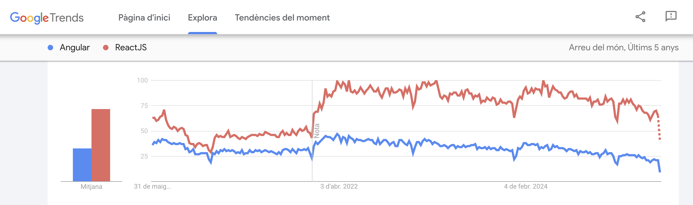

---

###### Tech Stack 🛠️ > Framework comparison (npm trends) 🔀


---

###### Tech Stack 🛠️ > TypeScript 🛡️

**TypeScript**: Typed superset of JavaScript.

- Catches errors at compile time.
- Improves code readability and maintainability.
- Provides better IDE support with autocompletion and type checking.
- Facilitates refactoring and reduces runtime bugs.
- Adopted by thoughtworks technology radar since April 2019

---

###### Tech Stack 🛠️ > Build Tool 🚀

**Vite**: Fast and modern build tool.

- Lightning-fast HMR (Hot Module Replacement).
- Optimized for modern JavaScript.
- Built-in support for typescript.
- Easy to no configuration.

---

###### Tech Stack 🛠️ > State Management 🧠

**React Context API**: Built-in state management.

- No need for external libraries.
- Simple and lightweight.
- Perfect for small to medium-sized apps.

---

## Architecture 🏗️

---

###### Architecture 🏗️ > Root folders 📂

```
pet-manager/
├── src/                   # 🧩 App code
├── tests/                 # 🧪 Integration tests
├── slides/                # 📊 This slides
├── .github/               # 🤖 CI/CD workflows
└── README.md              # 📚 Documentation
```

---

###### Architecture 🏗️ > src folders 📁

```
src/
├── adapters/
├── containers/
├── components/
├── context/
├── controllers/
├── pages/
├── services/
└── main.tsx
```

---

###### Architecture 🏗️ > SRP 🧩

Single Responsibility Principle.

```
src/
├── containers/
├── components/
└── pages/
```

- `containers` pass the logic to components.
- `components` render a piece of UI regardless of the data.
- `pages` render a page with some components on it.

All of them have a _single responsability_.

---

###### Architecture 🏗️ > OCP 🔓

Open/Closed Principle.

```
src/
└── adapters/
```

`Adapters` convert raw data into information for the app.

It extends the data we have with the `health` prop, for example.

---

###### Architecture 🏗️ > LSP 🔄

Liskov Substitution Principle.

```
src/
└── services/
```

`Services` fetch data from an API, without knowing whats in there.

When we test services we easily mock the response without breaking its functionality.

---

###### Architecture 🏗️ > ISP ✂️

Interface Segregation Principle.

```
src/
└── context/
```

`Contexts` are small and specific, avoiding unnecessary dependencies.

- App state knows column, order and amount of rows.
- Theme state knows wether is light or dark mode.
- Router state knows in which page are we.

---

###### Architecture 🏗️ > DIP 🔌

Dependency Inversion Principle.

```
src/
├── adapter/        # low-level module for API calls
├── controller/     # agnostic data transformation layer
└── service/        # high-level module
```

The `controller` is responsible for orchestrating the logic. It does not directly depend on how the data is fetched or transformed.

Instead, it relies on abstractions (the `service` and `adapter`).

---

###### Architecture 🏗️ > SOLID Summary 🧱

- **SRP**: Clear separation of concerns in `pages/`, `components/`, and `containers/`.
- **OCP**: `Adapters` extend functionality without modifying existing code.
- **LSP**: Mock `services` replace real ones seamlessly in tests.
- **ISP**: `Contexts` are small and specific, avoiding unnecessary dependencies.
- **DIP**: `Controllers` depend on abstractions (`services`, `adapters`), not implementations.

**Result**: A modular, testable, and maintainable architecture.

---

###### Architecture 🏗️ > Chart 📊

<iframe allowfullscreen frameborder="0" src="https://lucid.app/documents/embedded/06e91dc5-dc1b-410b-9df6-b291508bbad9"></iframe>

---

## DX 🛠️

---

###### DX 🛠️ > Quality 💪

```sh
# .husky/precommit
yarn prettier --write .
yarn eslint . --fix
yarn type:check
yarn test
yarn test:integration
```

- Pre-commit hooks (or `yarn precommit`)
- Github Actions workflow (although not enabled)

---

###### DX 🛠️ > Bruno 📝 Opensource IDE for exploring and testing APIs

<div class="image-pip">

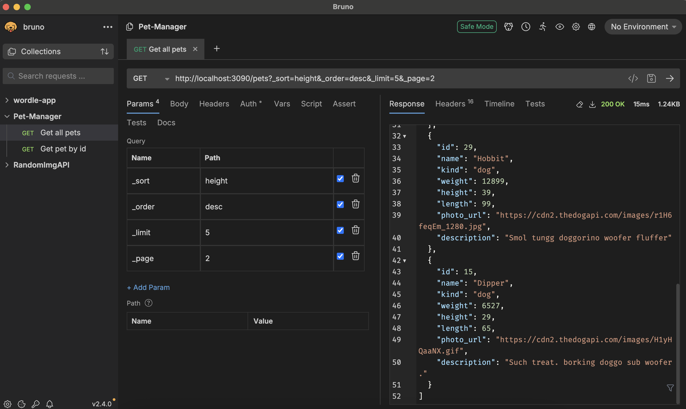

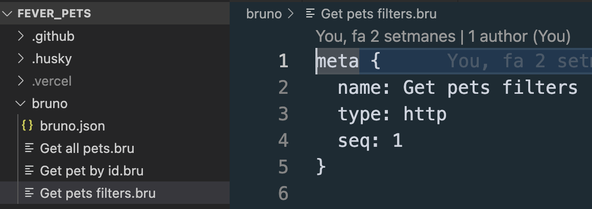

</div>

---

###### DX 🛠️ > Semantic commits 📝

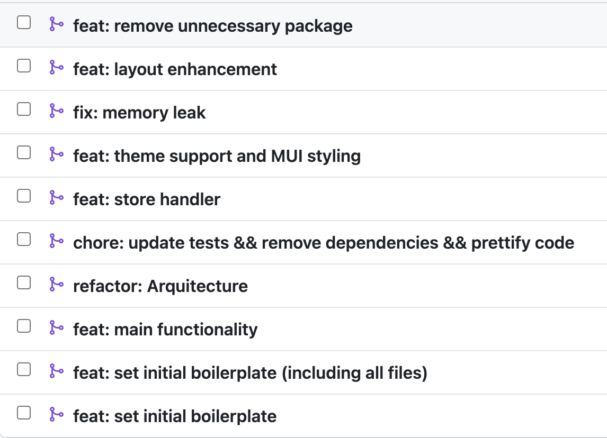

---

###### DX 🛠️ > Documentation 📘

README with:

- Setup
- Testing
- Folder structure
- Tooling notes

PR descriptions

- Generous PR descriptions.
- Explanation why those changes are important.
- If visual, include a screenshot of the results.

---

###### DX 🛠️ > PR descriptions 📘

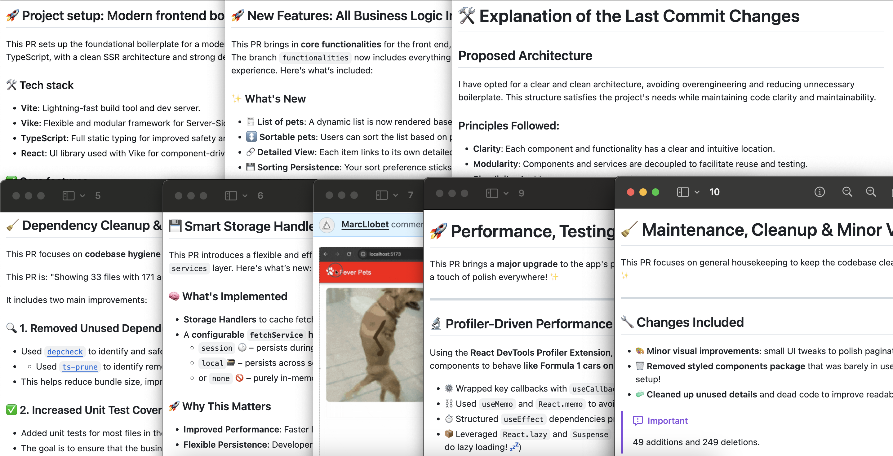

---

## Testing 🧪

---

###### Testing 🧪 > Unit testing 🧩

Unit testing with `vitest`

- Integration with Vite's ecosystem, tools and plugins.
- Shares the same configuration as Vite, reducing setup complexity.

Unit testing for components with `@testing-library`

- Focuses on testing components from the user's perspective.
- Provides utilities to simulate user interactions (e.g., clicks, typing).

```sh
Test Files  16 passed (16)
Tests  40 passed (40)
```

---

###### Testing 🧪 > Coverage 📊

<iframe 
  src="./coverage/index.html" 
  width="100%" 
  height="600px"
  style="background: white;"
></iframe>

---

###### Testing 🧪 > Integration testing 🔗


---

## UI 🎨

---

###### UI 🎨 > Lazy Loading ⚡

Split code in chunks to improve performance:

Modal `PetDetailsModal.tsx` loaded lazily in `PetPage.tsx`.

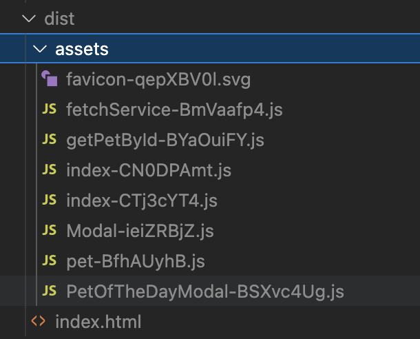

---

###### UI 🎨 > UI fallback 📸

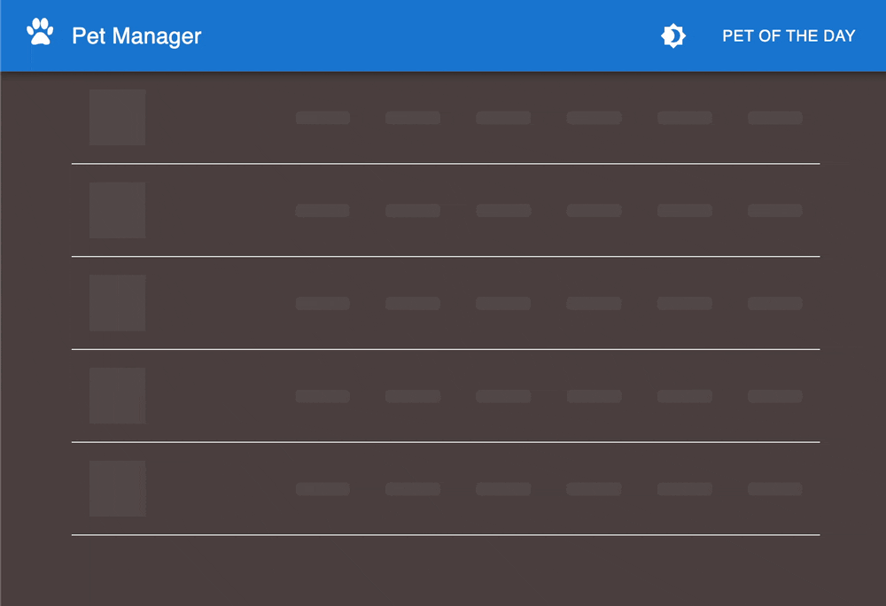

---

###### UI 🎨 > Responsive 📱

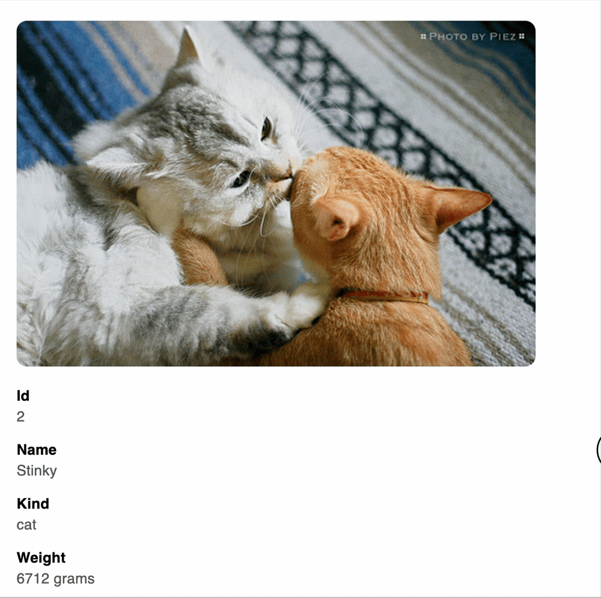

---

###### UI 🎨 > MUI 🎨

- **Material-UI (MUI)**: Pre-built React components.
  - Follows WAI-ARIA standards for accessibility.
  - Customizable themes.
  - Speeds up development.
  - Keyboard navigation + color contrast handled

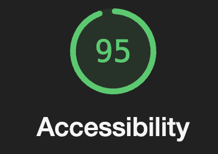

---

###### UI 🎨 > Accessibility 🎨

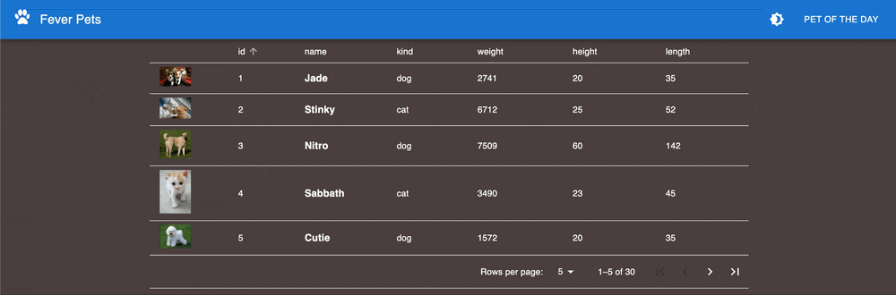

---

###### UI 🎨 > Lighthouse 🚦

<iframe src="./lighthouse.html" width="100%" height="600px"></iframe>

---

###### UI 🎨 > Avoid re-renders with profiler 🧑‍💻

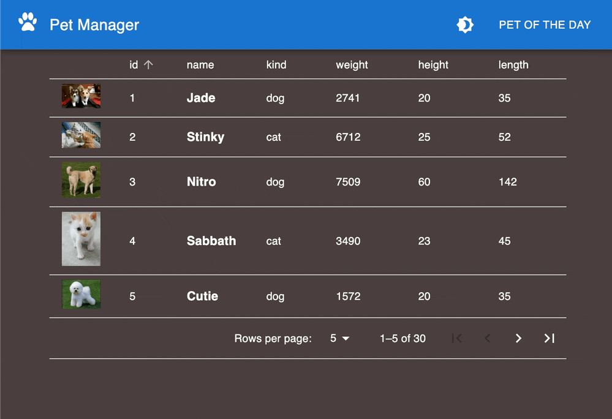

---

## Bundle 📦

---

###### Bundle 📦 > Analysis 📊

- Using `vite-bundle-visualizer` to show packages sizes.

<iframe src="./bundle.html" width="100%" height="600px"></iframe>

---

###### Bundle 📦 > Check dependencies 🔍 (depcheck)

- `depcheck` to detect unused packages.

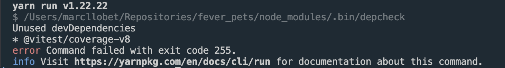
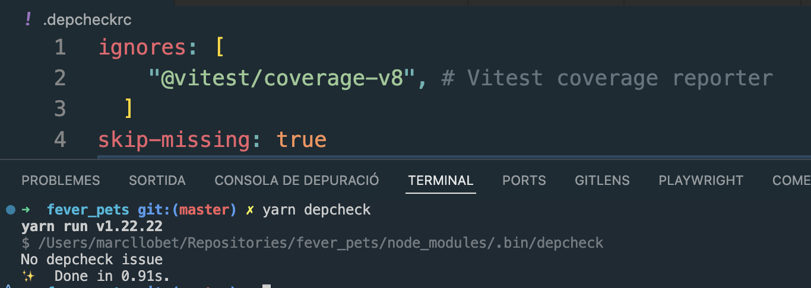

---

###### Bundle 📦 > Check dependencies 🔍 (npm-check)

- `npm-check` to get packages updated. Can be configuted together.

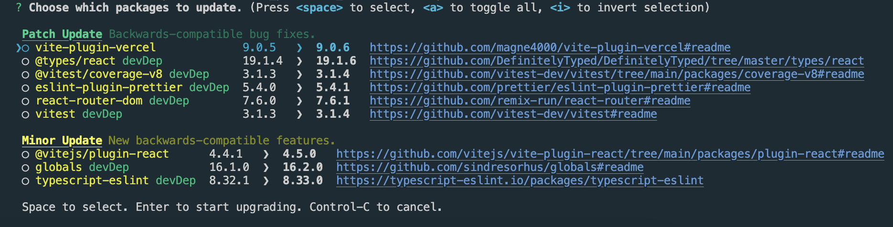

---

## To do 🔮

---

###### To do 🔮 > Local DX 🏡

- Add eslint customised rules.
- Check for ts-only files.
- Add coverage thresholds.
- Add documentation about expectations in contributions to the project.

---

###### To do 🔮 > CI 🧑‍⚕️

Enable CI worflows:

- protect main branch
- add checks for PRs
- set a PR template to empower good descriptions
- deploying from main branch

Add tools:

- static analysis (sonar cloud)
- dependency management (dependabot)
- observability (datadog)
- visual testing (playwright + Applitools)

---

###### To do 🔮 > UI 👷

- Create our own design system (storybook) aligned with our brand.
  Keep it growing as soon as components can be reused and are needed.

- Add error boundaries as soon as components require from different services.

- Keep splitting code in chunks.

---

###### To do 🔮 > Services 👨‍🏭

Migrate to GraphQl.

- Centralized Data Management
- Improved Performance
- Centralized caching logic
- Typed Schema

---

###### To do 🔮 > SSR? 🤖

- Is SEO a priority?
- Is TTFB(time to first byte) metric important?

If not, I would suggest keeping it simple (KISS), if we don't need it (YAGNI), I'd suggest to avoid the boilerplate.

---

###### To do 🔮 > Process 🧑‍💼

- Keep an eye to the Technology radar to be aware of new tech opportunities.
- Use a task manager (Jira) to link task to changes and have a better tracking of progress.
- Add analytics (Google analytics) to support data-driven decisions.
- Add UX tracking (FullStory) to understand better user needs.
- Add support for A/B testing for new iterations (Optimizely).
- Set actions, priorities and a roadmap based on goals.

---

## Thanks! 🙏
